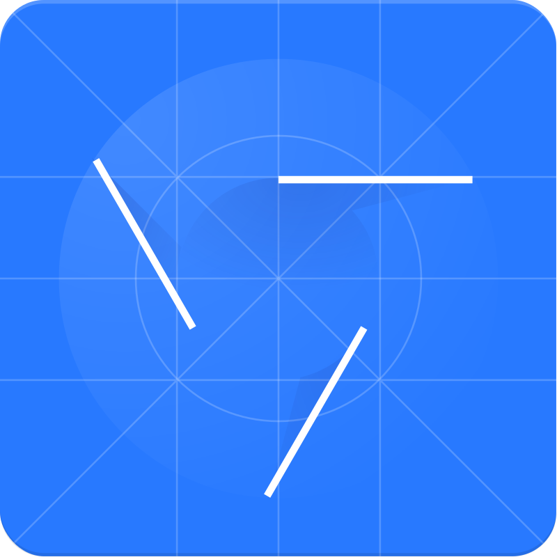

<h1 align="center">Hi 👋, I'm Randima Edussuriya</h1>

  

---

## 🚀 About Me

- 🎓 IT Undergraduate pursuing a Bachelor of Information Technology (BIT) at the University of Moratuwa.  
- 💡 Passionate about building secure, user-friendly, and scalable software solutions.  
- 🚀 Continuously learning, experimenting, and improving my development skills.

---

## 👨‍💻 Tech Stack & Tools

<table>
  <tr>
    <td><h4>Programming Languages:</h4></td>
    <td align="center">
        <code></code> 
        JavaScript
    </td>
    <td align="center">
        <code></code> 
        PHP
    </td>
    <td align="center">
        <code></code> 
        Java
    </td>
  </tr>
</table>

<table>
  <tr>
    <td><h4>Frontend:</h4></td>
    <td align="center">
        <code></code> 
        React.js
    </td>
    <td align="center">
        <code></code> 
        Tailwind CSS
    </td>
    <td align="center">
        <code></code> 
        React Bootstrap
    </td>
    <td align="center">
        <code></code> 
        Bootstrap
    </td>
    <td align="center">
        <code></code> 
        HTML
    </td>
    <td align="center">
        <code></code> 
        CSS
    </td>
  </tr>
</table>

<table>
  <tr>
    <td><h4>Backend & Database:</h4></td>
    <td align="center">
        <code></code> 
        Node.js
    </td>
    <td align="center">
        <code></code> 
        Express.js
    </td>
    <td align="center">
        <code></code> 
        MySQL
    </td>
    <td align="center">
        <code></code> 
        MongoDB
    </td>
  </tr>
</table>

<table>
  <tr>
    <td><h4>Tools:</h4></td>
    <td align="center">
        <code></code> 
        Git
    </td>
    <td align="center">
        <code></code> 
        GitHub
    </td>
    <td align="center">
        <code></code> 
        VS Code
    </td>
    <td align="center">
        <code></code> 
        Postman
    </td>
    <td align="center">
        <code></code> 
        Chrome DevTools
    </td>
    <td align="center">
        <code></code> 
        XAMPP
    </td>
  </tr>
</table>

---

## 📈 GitHub Stats

  
  

  

---

## 🌐 Connect with Me

---

### _⭐️ Feel free to explore my repositories and leave a star if you find something useful!_